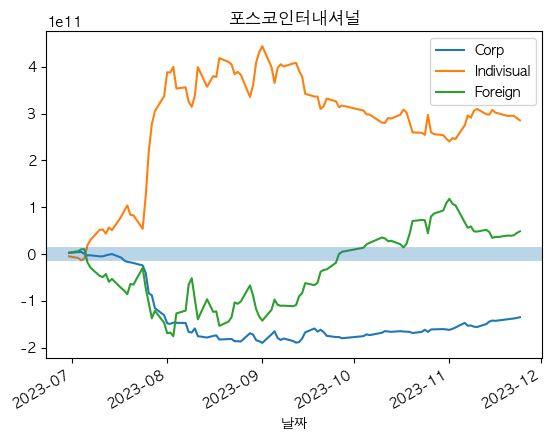

# Data-Engineer

## Loader
### 01_data2db
- Open API / Close API
- to MYSQL DB

### 02_db2local
- MYSQL DB -> to local

## Model
### model_parameter
- Fundamental_Param
- Technical_Param 
    - Moving_Average_Param
    - Linear_Coef_Param

### 04_model
- Fundamental_Model
- Technical_Model
- Trader_Model

### 05_main (model + model_parameter)
- Fundamental
    - Fundamental_Param
    - Fundamental_Model
- Technical
    - Technical_Param
    - Technical_Model
- Trader_Model

## Order
### Order
#### 06_order_ki
- KoreaInvestment

## 99
### Analysis
### 99_factor_analysis
- Model Paramter Tuning Related

### 99_market_analysis
- Market Trader Volume Related
    - [Corp / Foriegn / Indivisual]

### 99_position_analysis
- Current Position Related

### 99_stock_analysis
- Main result analysis before order

